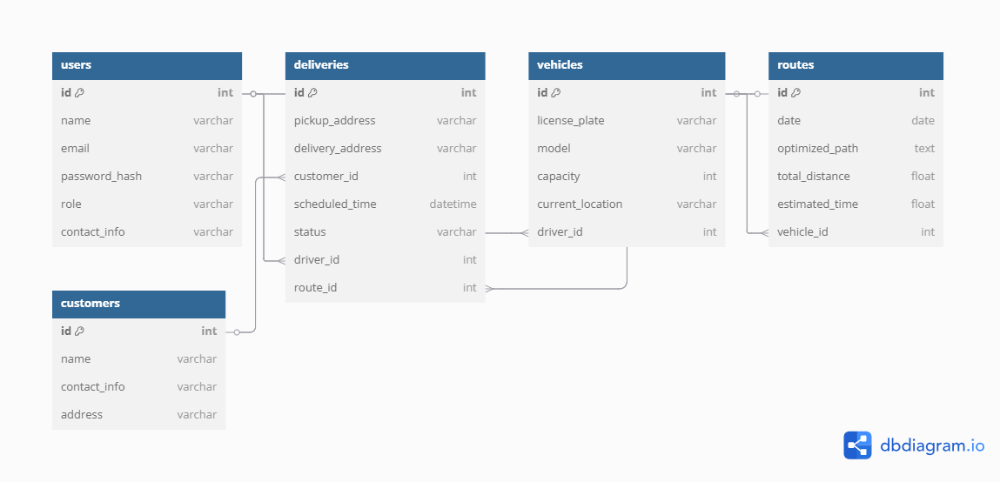

# RouteOptim Data Model Documentation

## Introduction

The "RouteOptim" project aims to enhance delivery efficiency for small businesses by optimizing delivery routes. This document provides a detailed overview of the data model, outlining the structure, relationships, and attributes of the database entities.

## Entity-Relationship Diagram (ERD)

The ERD visually represents the entities within the system and their interrelationships.

## Entities and Attributes

The primary entities in the "RouteOptim" data model are:

1. **Users**
2. **Deliveries**
3. **Vehicles**
4. **Routes**
5. **Customers**

### 1. Users

This table stores information about all users interacting with the system, including administrators, drivers, and customers.

- **Attributes:**
  - `id`: Integer, Primary Key, Auto-increment
  - `name`: Varchar, User's full name
  - `email`: Varchar, Unique email address
  - `password_hash`: Varchar, Hashed password for authentication
  - `role`: Varchar, Defines user role (`admin`, `driver`, `customer`)
  - `contact_info`: Varchar, Contact details

### 2. Deliveries

This table manages details of each delivery order.

- **Attributes:**
  - `id`: Integer, Primary Key, Auto-increment
  - `pickup_address`: Varchar, Origin address
  - `delivery_address`: Varchar, Destination address
  - `customer_id`: Integer, Foreign Key referencing `customers.id`
  - `scheduled_time`: Datetime, Planned delivery time
  - `status`: Varchar, Current status (`pending`, `in-transit`, `delivered`)
  - `driver_id`: Integer, Foreign Key referencing `users.id`
  - `route_id`: Integer, Foreign Key referencing `routes.id`

### 3. Vehicles

This table contains information about the fleet of vehicles used for deliveries.

- **Attributes:**
  - `id`: Integer, Primary Key, Auto-increment
  - `license_plate`: Varchar, Unique vehicle identifier
  - `model`: Varchar, Vehicle model
  - `capacity`: Integer, Load capacity
  - `current_location`: Varchar, Real-time location
  - `driver_id`: Integer, Foreign Key referencing `users.id`

### 4. Routes

This table defines the optimized delivery routes.

- **Attributes:**
  - `id`: Integer, Primary Key, Auto-increment
  - `date`: Date, Route assignment date
  - `optimized_path`: Text, Serialized data of the route
  - `total_distance`: Float, Total distance covered
  - `estimated_time`: Float, Estimated duration
  - `vehicle_id`: Integer, Foreign Key referencing `vehicles.id`

### 5. Customers

This table holds information about customers receiving deliveries.

- **Attributes:**
  - `id`: Integer, Primary Key, Auto-increment
  - `name`: Varchar, Customer's full name
  - `contact_info`: Varchar, Contact details
  - `address`: Varchar, Delivery address

## Relationships

- **Users to Deliveries**: One-to-Many. A user (driver) can handle multiple deliveries.
- **Deliveries to Customers**: Many-to-One. Each delivery is linked to a single customer.
- **Vehicles to Routes**: One-to-Many. A vehicle can be assigned multiple routes over time.
- **Routes to Deliveries**: One-to-Many. Each route encompasses multiple deliveries.
- **Vehicles to Users**: One-to-One. Each vehicle is assigned to a single driver.

## Data Dictionary

The data dictionary provides detailed descriptions of each attribute within the tables.

### Users Table

| Attribute       | Data Type | Description                     |
|-----------------|-----------|---------------------------------|
| `id`            | Integer   | Unique identifier for each user |
| `name`          | Varchar   | Full name of the user           |
| `email`         | Varchar   | User's email address            |
| `password_hash` | Varchar   | Encrypted password              |
| `role`          | Varchar   | User's role in the system       |
| `contact_info`  | Varchar   | User's contact information      |

### Deliveries Table

| Attribute         | Data Type | Description                               |
|-------------------|-----------|-------------------------------------------|
| `id`              | Integer   | Unique identifier for each delivery       |
| `pickup_address`  | Varchar   | Address where the delivery originates     |
| `delivery_address`| Varchar   | Address where the delivery is destined    |
| `customer_id`     | Integer   | References the customer receiving the delivery |
| `scheduled_time`  | Datetime  | Planned time for the delivery             |
| `status`          | Varchar   | Current status of the delivery            |
| `driver_id`       | Integer   | References the driver assigned to the delivery |
| `route_id`        | Integer   | References the route assigned to the delivery |

### Vehicles Table

| Attribute        | Data Type | Description                               |
|------------------|-----------|-------------------------------------------|
| `id`             | Integer   | Unique identifier for each vehicle        |
| `license_plate`  | Varchar   | Vehicle's license plate number            |
| `model`          | Varchar   | Vehicle model                             |
| `capacity`       | Integer   | Load capacity of the vehicle              |
| `current_location`| Varchar  | Current location of the vehicle           |
| `driver_id`      | Integer   | References the driver assigned to the vehicle |

### Routes Table

| Attribute        | Data Type | Description                               |
|------------------|-----------|-------------------------------------------|
| `id`             | Integer   | Unique identifier for each route          |
| `date`           | Date      | Date of the route                         |
| `optimized_path` | Text      | Serialized data representing the route    |
| `total_distance` | Float     | Total distance of the route               |
| `estimated_time` | Float     | Estimated time to complete the route      |
| `vehicle_id`     | Integer   | References the vehicle assigned to the route |

### Customers Table

| Attribute       | Data Type | Description                               |
|-----------------|-----------|-------------------------------------------|
| `id`            | Integer   | Unique identifier for each customer       |
| `name`          | Varchar   | Full name of the customer                 |
| `contact_info`  | Varchar   | Contact information of the customer       |
| `address`       | Varchar   | Address of the customer                   |

## Notes

- Ensure that all foreign key relationships are properly indexed to maintain database integrity and optimize query performance.
- The `optimized_path` in the `routes` table should be structured in a format that can be easily parsed by the application for route reconstruction.

---

## 6. Set Up the Development Environment

For the development and testing of the **RouteOptim** system, the following steps were taken:

- **Database Management System**: 
  - We selected **PostgreSQL** for the database as it supports complex queries, constraints, and foreign key relationships, making it a good fit for the project.
- **Development Environment**: 
  - We used **Docker** to create isolated environments for development and testing, ensuring consistency across different stages of development.
  - A Docker container for the database was set up, and the environment was configured to ensure seamless deployment and testing.

---

## 7. Implement the Database Schema

Once the schema design was complete, we implemented it using the following steps:

- **SQL Commands**:
  - We wrote SQL commands to create the necessary tables and establish foreign key relationships.
- **Data Integrity**:
  - We applied constraints such as `NOT NULL` to ensure the consistency and integrity of the data.
  - Unique constraints were added to attributes like email in the `users` table to prevent duplicates.

---

## 8. Develop Application Logic

The next step was to implement the business logic of the **RouteOptim** system using the Django framework.

### Step 8.1: Create the Django Project and Application

We created a new Django project and application:

- **Django Project Setup**: 
  - We created a Django project named `delivery_management`.
- **Django Application**: 
  - A Django application was created inside the project folder named `delivery_management` to handle the delivery management functionalities.

### Step 8.2: User Registration View

To implement user registration, we created a registration view to handle both GET and POST requests for the user registration form. 

- **User Registration**: 
  - We used Django’s built-in `UserCreationForm` to simplify user authentication and password management.
  - After successful registration, users are redirected to the login page, and a success message is displayed.

### Step 8.3: Set Up URLs for Registration

We added the URL pattern for the registration view:

- **URL Configuration**:
  - The route `/register/` is mapped to the `register` view we created.

### Step 8.4: Create Registration Template

We created the registration template for the user to enter their details:

- **Template Location**:
  - The registration template was placed in `templates/delivery_management/register.html`.
- **Form Fields**:
  - The page includes form fields to capture user information such as name, email, password, etc.

### Step 8.5: Static Files Setup for Styling

For the styling of the registration page, we configured static files:

- **CSS Styling**: 
  - A `style.css` file was created under the `static/css/` directory to style the registration page.
- **Static Files Configuration**: 
  - Static files were configured properly in the `settings.py` file by adding the `STATIC_URL` setting.

---

## Conclusion

At this stage, the **RouteOptim** system has a fully functional user registration page. Users can register their accounts, and the page is styled for better user experience. 

### Next Steps:

- **Login Functionality**: Implement login and authentication for users.
- **Password Reset**: Add functionality for password recovery.
- **Route Optimization**: Develop the route optimization logic to calculate the best delivery paths.
- **Delivery Management**: Implement the delivery tracking system to manage deliveries based on optimized routes.
